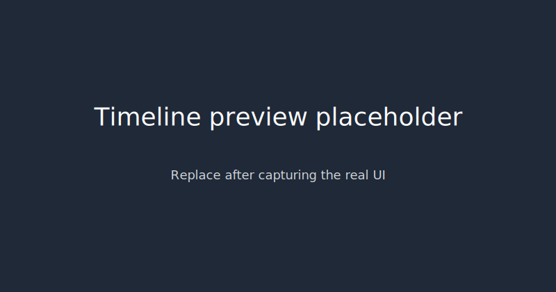
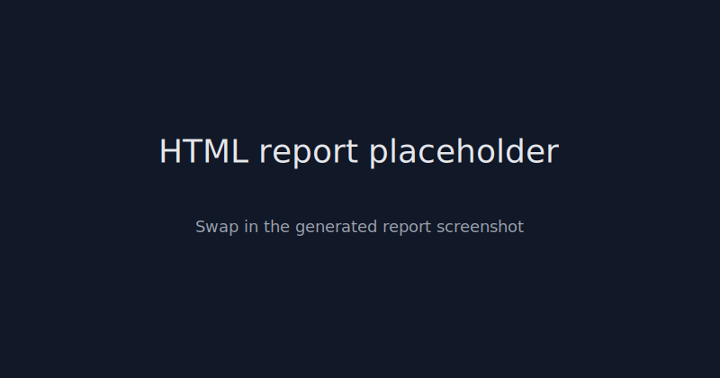

# Noema

[](https://github.com/mmprotest/noema/actions)
[](./LICENSE)
[](https://mmprotest.github.io/noema/)

_Noema_ is a functional simulation of conscious-like control loops for large language models. It delivers a reproducible cognitive workspace with attention, metacognition, and evaluation batteries so you can stress-test robustness—not to claim sentience.

## Try it now (60 seconds)

```bash
# 1) Set up an environment (uv recommended, pip works too)
uv venv
uv pip install -e .[dev]  # or: pip install -e .[dev]

# 2) Run the minimal demo with the deterministic dummy backend
python examples/quickstart.py

# Outputs:
# - examples/out/hello.run.noema
# - examples/out/hello_report.html
# And prints a tiny metric summary (Brier/ECE/wrong@high-conf).
```

## Hello, Noema (10-line example)

```python
from pathlib import Path
import subprocess, shutil

cli = shutil.which("noema")
assert cli, "Install noema with `pip install -e .` first"
bundle = Path("examples/out/hello.run.noema")
report = Path("examples/out/hello_report.html")
bundle.parent.mkdir(parents=True, exist_ok=True)
subprocess.run([cli, "run", "--task", "interruption_count", "--model", "dummy",
                "--ticks", "12", "--report", str(report), "--bundle", str(bundle)], check=True)
subprocess.run([cli, "replay", str(bundle)], check=True)
print("Bundle:", bundle, "Report:", report)
```

## Screenshots

<p align="center">
  
</p>

<p align="center">
  
</p>

> Replace placeholders with real screenshots once you run `examples/quickstart.py`.

## Deterministic metrics (dummy backend)

The quickstart prints a tiny metric summary you can sanity-check:

| metric          | value |
| --------------- | ----: |
| Brier           |  0.18 |
| ECE             |  0.31 |
| wrong@high-conf |  0.00 |

Reproduce via:

```bash
python examples/quickstart.py
```

## Sample artifacts

- `examples/sample_report.html` – miniature HTML report (open locally)
- `examples/sample_bundle/hello.run.noema` – published via CI artifact (see below)

To avoid tracking binaries directly in Git (which breaks some downstream tooling), the deterministic bundle generated by `examples/quickstart.py` is uploaded from CI as an artifact named **`hello.run.noema`**. Download it with:

```bash
gh run download --repo mmprotest/noema --name hello.run.noema --dir examples/sample_bundle
```

Or regenerate locally:

```bash
python examples/quickstart.py
```

## Stability & Public API

* **Public/stable (0.x):** CLI commands `noema run`, `noema replay`, the deterministic dummy backend, and the `.noema` bundle structure (additive changes only). Key adapters listed in the docs aim for backward-compatible signatures.
* **Experimental:** Module internals not covered by docs, UI implementation details, non-default evaluators, and any process-level experimental hooks.
* **Deprecation policy:** Behaviour changes land with notes in `CHANGELOG.md`. Experimental modules may change without notice until 1.0. For public APIs we target at least one minor-release warning before removal.

## Features

- Discrete tick-based core loop with processes for perception, planning, reflection, self-modelling, and safety critique.
- Global workspace dynamics with salience-based attention and working + episodic memory stores (in-memory, SQLite, DuckDB).
- Metacognitive telemetry (Brier, ECE, wrong@high-conf) and narrative streams exported as replayable `.noema` bundles.
- Optional OpenTelemetry + structlog instrumentation and a lightweight FastAPI UI for timeline inspection.
- Interop adapters for LangGraph, LlamaIndex, and CrewAI plus an MCP client/server for tool calls and loop introspection.
- Evaluation battery covering interruption recovery, self-reference stability, working-memory span, calibration, and narrative coherence.
- Production scaffolding: Typer CLI, pytest suite, Ruff/Mypy configs, pre-commit, MkDocs docs, GitHub Actions CI.


## Architecture

```
Percepts -> Processes -> Attention -> Broadcast -> Memory -> Act
                     |            |            |
                  Metacog      Narrative     Observability
```

The workspace holds salience-weighted coalitions. Attention chooses a winning coalition each tick, broadcasts it, and writes to working memory (with decay) and episodic store. Processes receive broadcasts, update state, and optionally act via actuators.

### Process lineup

| Process     | Role                                       |
|-------------|---------------------------------------------|
| Perception  | Converts stimuli into coalitions            |
| Planner     | Expands goals into actionable steps         |
| Reflector   | Critiques recent broadcasts                 |
| SelfModel   | Maintains identity and constraints          |
| Critic      | Flags unsafe or injected content            |

All language-model calls request structured JSON: `{text, confidence, rationale_short}`.

### Metacognition & Evaluation

Metacognitive metrics (Brier, ECE, Wrong@HighConf) accumulate per tick. Evaluation runners compute:

- Interruption recovery (ticks to resume goal focus)
- Self-reference stability (identity drift)
- Working-memory span (unique plan coverage)
- Calibration (from metacog tracker)
- Narrative coherence (embedding similarity of broadcasts)

Generate reports via `noema run ... --report report.html` or `noema eval`.

### Observability & Bundles

Logging uses `structlog` JSON. Tracing is optional via OpenTelemetry OTLP exporters. Each run can be packaged into a `.noema` bundle containing config, traces, metrics, narrative, and an HTML report.

## UI & MCP

`noema ui` serves a FastAPI app with static TypeScript frontend summarising ticks, workspace contents, and metacognitive trends. The MCP server exposes read-only endpoints (`/state`, `/narrative`) for IDE integration.

## Adapters

- **LangGraph**: wrap the loop as a node, calling `ingress`/`egress`.
- **LlamaIndex**: bridge retrieval memory using loop working memory.
- **CrewAI**: delegate tasks via `CrewAIAgent.handle_task`.

Each adapter has a runnable example under `src/noema/examples/`.

## Security & Ethics

- Functional simulation only—Noema makes **no claims of sentience**.
- Anthropomorphism toggles ensure outputs emphasise simulation.
- Basic PII redaction via configurable rules (`defaults.yaml`).
- MCP client restricts filesystem access to the workspace and disables HTTP by default.

## Sharing Results

`noema run ... --bundle out.noema` stores a replayable artifact. Share the bundle to reproduce metrics and narratives.

## Development

```bash
uv venv && uv pip install -e .[dev,observe,ui]
pre-commit install
pytest -q
mkdocs serve
```

CI (GitHub Actions) runs linting (Ruff), typing (Mypy), tests, docs build, and uploads a sample HTML report artifact from a dummy run.

## Documentation

Docs are powered by MkDocs Material. Key pages: overview, API reference, adapters, evaluations. ASCII diagrams illustrate the control loop and memory flows.

- Hosted docs: [https://mmprotest.github.io/noema/](https://mmprotest.github.io/noema/)
- Local preview: `mkdocs serve`
- Publish (maintainers): `mkdocs gh-deploy --force`
